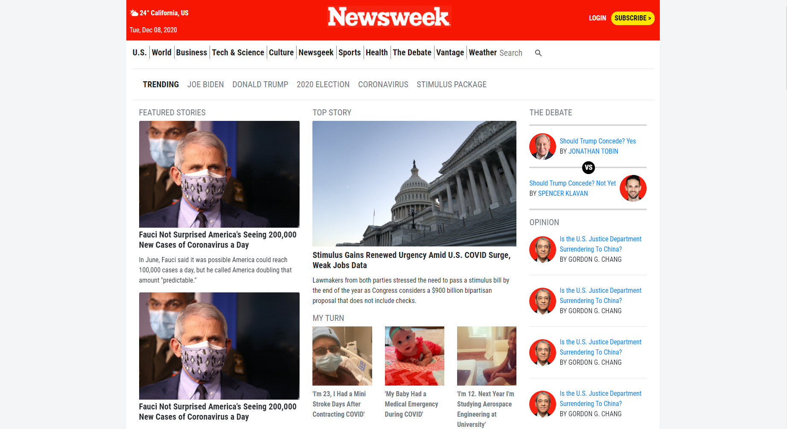

# NewsWeek Page

> This is a copy of the [Newsweek](https://www.newsweek.com) page, made with boostrap and love <3.

Additional description about the project and its features.

## Built With

- HTML
- Bootstrap
- CSS
- Hard work

## Live Demo

[Live Demo Link](https://luisvinicius09.github.io/newsweek-webpage/)

## Getting Started

Download the code and open it on your text editor to edit it. And for see it, open the html file on the browser.

### Prerequisites

Text Editor
Browser

### Install

- If you want to run the linters... run 'npm install'

### Usage

Open in the browser

### Run tests

- Stylelint -> 'npx stylelint "**/*.{css,scss}"'
- Hint -> 'npx hint .'

## Authors

👤 **Luis Vinicius Marques**

- GitHub: [@luisvinicius09](https://github.com/luisvinicius09)
- Twitter: [@luisvinicius09](https://twitter.com/luisvinicius09)
- LinkedIn: [LinkedIn](https://www.linkedin.com/in/luis-vinicius/)

👤 **Kalu Chinasa Agu**

- GitHub: [@Nasa28](https://github.com/Nasa28)
- Twitter: [@twitterhandle](https://twitter.com/twitterhandle)
- LinkedIn: [LinkedIn](https://linkedin.com/linkedinhandle)

## 🤝 Contributing

Contributions, issues, and feature requests are welcome!

Feel free to check the [issues page](https://github.com/luisvinicius09/newsweek-webpage/issues).

## Show your support

Give a ⭐️ if you like this project!

## Acknowledgments

- Hat tip to anyone whose code was used
- Inspiration
- etc
